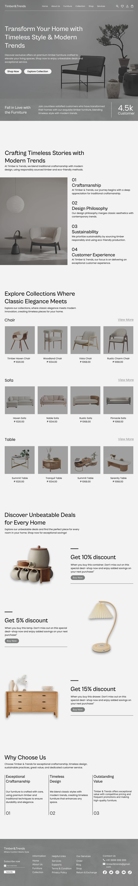

# Timber&Trends

Timber&Trends is an furniture shop, offering a wide range of high-quality and stylish furniture pieces designed to transform any space into a beautifully furnished environment. This project is a personal endeavor aimed at showcasing my skills in UI/UX design.

## Purpose

The purpose of this project is to design a website for a furniture shop, prioritizing the visual appearance of the website to encourage users to make purchases. 

## Link

You can view the project on Behance:

[Timber&Trends UI/UX Design on Behance](https://www.behance.net/gallery/204192675/Timber-Trends)

## Design Preview

